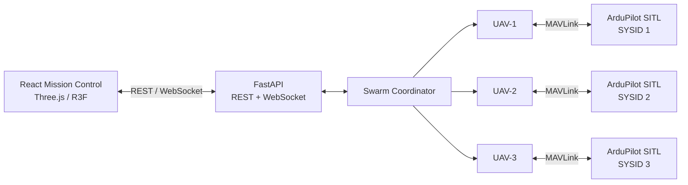

# SwarmSearch

**Fault-tolerant cooperative multi-UAV search and recovery in ArduPilot SITL.**

SwarmSearch is a software-only multi-UAV coordination system built with
Python, MAVLink and ArduPilot SITL.

It coordinates multiple simulated autonomous aircraft across a shared search
area, generates cooperative coverage routes, monitors each UAV through live
MAVLink telemetry, detects or injects mission-level failures, and redistributes
unfinished work to surviving aircraft.

A browser-based mission-control interface provides a live 3D representation of
the simulated fleet, coverage routes, vehicle states, mission events and
failure recovery.

> **Status:** v0.1 — active development  
> The current release establishes the simulation, mission-planning,
> coordination, visualization and fault-recovery foundation of SwarmSearch.

---

## Demo architecture



SwarmSearch does not fake vehicle motion in the frontend. Aircraft position,
altitude, armed state and flight mode originate from live ArduPilot SITL
telemetry.

---

## What it currently does

### Cooperative search planning

A rectangular search region is divided between the available UAVs.

Each vehicle receives a lawnmower-style coverage route through its assigned
zone.

For every new mission, SwarmSearch reads the aircraft's actual current
position and evaluates multiple valid orientations of the same coverage path.
It selects the route entry closest to that vehicle, reducing unnecessary
transit before coverage begins.

The coverage area itself does not change — only traversal orientation does.

### Concurrent autonomous flight

Three ArduPilot Copter SITL vehicles are controlled concurrently through
MAVLink.

The default fleet uses:

| Vehicle | SITL TCP | Cruise altitude |
|---|---:|---:|
| UAV-1 | `5760` | 10 m |
| UAV-2 | `5770` | 12 m |
| UAV-3 | `5780` | 14 m |

Different cruise altitudes provide simple vertical deconfliction.

This is **not** intended to represent a complete real-world collision-avoidance
system.

### Telemetry-validated navigation

SwarmSearch uses real MAVLink telemetry rather than timers to determine
vehicle progress.

The coordinator monitors data including:

- global position
- relative altitude
- vehicle mode
- armed state
- home position
- EKF/navigation readiness
- command acknowledgements
- mission state

Each UAV has its own telemetry receiver so MAVLink messages are consumed
independently and safely.

### Fault-tolerant recovery

Failures can be injected while a mission is running.

When a UAV is withdrawn:

1. its current mission segment is interrupted;
2. the already completed portion is preserved;
3. its unfinished ordered coverage route is reconstructed;
4. a healthy survivor is selected;
5. the unfinished segment is added to that vehicle's work queue;
6. the remaining fleet continues the mission.

The recovery route includes a repositioning anchor so the receiving UAV can
join the interrupted path correctly rather than regenerating the entire search
zone.

### Phase-aware safe withdrawal

A SwarmSearch failure represents a **mission-level vehicle withdrawal**, not
instant physical destruction of an aircraft.

Depending on when the failure is injected:

- a vehicle that has not launched remains on the ground;
- a vehicle in the arming phase is explicitly disarmed;
- an airborne vehicle is commanded to land safely;
- telemetry continues while a failed airborne vehicle descends.

This allows the coordinator's failure-recovery behaviour to be tested without
pretending that SITL is modelling destroyed motors, a dead flight controller or
a completely lost radio link.

### Mission control UI

The React / Three.js frontend visualizes:

- live UAV position and altitude;
- representative quadrotor models;
- assigned coverage routes;
- transit from current position to route entry;
- mission and vehicle states;
- recovery count;
- failed vehicles;
- real-time event timeline;
- operator-triggered failure injection.

The UI communicates with FastAPI through REST and WebSockets.

---

# Quick start

## Supported environment

The current development target is Linux.

You need:

- Git
- Python **3.11+**
- Node.js **20+**
- npm
- a Debian/Ubuntu-family system if the bootstrap script needs to install
  ArduPilot automatically

ArduPilot's own Linux documentation provides an automated prerequisite
installer for Debian-based systems.

---

## One-command local setup and run

Clone the repository and run:

```bash
git clone https://github.com/SilentKnight742/SwarmSearch.git
cd SwarmSearch
bash scripts/dev.sh
```

Or as a single shell command:

```bash
git clone https://github.com/SilentKnight742/SwarmSearch.git && cd SwarmSearch && bash scripts/dev.sh
```

The launcher will:

1. locate an existing ArduPilot installation at
   `~/tools/ardupilot`;
2. clone ArduPilot if it is not installed;
3. run ArduPilot's prerequisite installer when it performs a fresh clone;
4. create the SwarmSearch Python virtual environment;
5. install the Python package and test dependencies;
6. install the frontend dependencies;
7. start three ArduPilot Copter SITL instances;
8. wait for all three MAVLink TCP endpoints;
9. start the FastAPI backend;
10. start the Vite frontend.

The first run can take several minutes because ArduPilot may need to install
system dependencies and build SITL.

The script may request `sudo` access during a first-time ArduPilot setup.

When ready:

```text
Mission Control
http://127.0.0.1:5173

Backend
http://127.0.0.1:8000
```

Press **Ctrl+C** in the launcher terminal to stop the local demo.

---

## Existing ArduPilot installations

SwarmSearch defaults to:

```text
~/tools/ardupilot
```

To use another checkout:

```bash
ARDUPILOT_DIR=/path/to/ardupilot bash scripts/dev.sh
```

If the ArduPilot checkout contains its own `.venv`, SwarmSearch will use it.

Otherwise it falls back to the system Python environment configured by the
standard ArduPilot prerequisite installer.

---

# Using Mission Control

Open:

```text
http://127.0.0.1:5173
```

The top bar initially shows:

```text
SIMULATOR AVAILABLE
```

Select **Launch** to obtain control of the simulator.

You can then configure:

- search width;
- search height;
- lane spacing.

Select **Start Mission**.

SwarmSearch will:

```text
connect fleet
    ↓
validate navigation state
    ↓
establish mission origin
    ↓
capture actual UAV positions
    ↓
partition search region
    ↓
select nearest valid route entries
    ↓
arm fleet
    ↓
take off at deconflicted altitudes
    ↓
execute cooperative coverage
    ↓
recover unfinished work after failures
    ↓
land surviving aircraft
```

During an active mission, use **Inject Failure** on a fleet entry to test the
recovery system.

---

# Simulator session queue

SwarmSearch includes a session manager intended for a future public hosted
demo.

The backend supports:

```text
AVAILABLE
    ↓
ACTIVE CONTROLLER

IN USE
    ↓
FIFO QUEUE
    ↓
YOUR TURN
    ↓
ACTIVE CONTROLLER
```

The queue currently provides:

- one active simulator controller;
- FIFO ordering;
- up to 10 waiting users;
- session heartbeats;
- stale queue cleanup;
- grant acknowledgement;
- idle lease expiry;
- hard session expiry;
- server-side authorization of mission actions.

Mission control authorization is enforced by the backend rather than only by
the frontend.

Locally, the first browser simply receives control immediately.

---

# Running components manually

The one-command launcher is recommended, but each layer can also be run
independently.

## 1. ArduPilot SITL

```bash
bash scripts/start_sitl.sh
```

This launches three Copter instances with unique MAVLink system IDs and offset
starting locations.

## 2. Backend

From the repository root:

```bash
source .venv/bin/activate
python -m uvicorn backend.main:app --host 127.0.0.1 --port 8000
```

## 3. Frontend

```bash
cd frontend
npm run dev
```

Open:

```text
http://127.0.0.1:5173
```

The Vite development server proxies `/api` and `/ws` to the FastAPI backend.

---

# Tests

Run the unit test suite with:

```bash
source .venv/bin/activate
python -m pytest -v
```

The test suite covers the coordination primitives including:

- coverage generation;
- position-aware coverage orientation;
- recovery-route construction;
- failure behaviour;
- session/queue behaviour.

Additional SITL integration scripts are available under `scripts/`.

Examples include:

```bash
python scripts/smoke_fleet.py
python scripts/run_recovery_mission.py
python scripts/test_takeoff_failure.py
python scripts/test_arming_failure.py
python scripts/test_landing_failure.py
```

These require the SITL fleet to be running.

---

# Project structure

```text
SwarmSearch/
│
├── backend/
│   ├── event_broker.py
│   ├── main.py
│   ├── runtime.py
│   └── session_manager.py
│
├── frontend/
│   ├── src/
│   │   ├── components/
│   │   │   └── MissionScene.jsx
│   │   ├── api.js
│   │   ├── App.jsx
│   │   └── useMissionControl.js
│   └── package.json
│
├── scripts/
│   ├── dev.sh
│   ├── start_sitl.sh
│   ├── smoke_fleet.py
│   ├── run_recovery_mission.py
│   └── test_*_failure.py
│
├── src/
│   └── swarmsearch/
│       ├── config.py
│       ├── coordinator.py
│       ├── coverage.py
│       ├── events.py
│       ├── geometry.py
│       ├── models.py
│       ├── recovery.py
│       ├── state_machine.py
│       └── vehicle.py
│
├── tests/
├── pyproject.toml
└── README.md
```

---

# Core architecture

## `Vehicle`

Owns communication with one ArduPilot vehicle.

Responsibilities include:

- MAVLink connection lifecycle;
- telemetry reception;
- mode changes;
- arming/disarming;
- takeoff;
- waypoint navigation;
- landing;
- phase-aware failure handling.

Each vehicle has a dedicated telemetry receiver thread and cached vehicle
state.

## `SwarmCoordinator`

Owns mission-level coordination.

It is responsible for:

- fleet initialization;
- mission-origin selection;
- search planning;
- task queues;
- concurrent vehicle workers;
- mission state;
- failure recovery;
- reassignment of unfinished routes;
- completion and landing.

## Coverage planner

The planner:

1. partitions the search rectangle;
2. creates a lawnmower route per zone;
3. generates equivalent route orientations;
4. compares each entry point with the vehicle's actual current position;
5. chooses the closest valid orientation.

This makes consecutive missions position-aware without moving or deforming the
assigned search region.

## Recovery planner

When work is interrupted, the recovery system preserves the unfinished ordered
route and assigns it to a healthy aircraft.

Survivor selection currently uses a simple load estimate based on queued and
active route segments.

It is deliberately understandable and deterministic rather than pretending to
be a globally optimal swarm scheduler.

## Event broker

Mission and vehicle events are reduced into a backend state snapshot and
broadcast over WebSockets.

High-frequency telemetry updates drive the live visualization while significant
mission events populate the operator timeline.

---

# API overview

Primary endpoints:

```text
GET  /api/health
GET  /api/state

GET  /api/session
POST /api/session/request
POST /api/session/heartbeat
POST /api/session/ack
POST /api/session/release

POST /api/mission/start
POST /api/mission/failure/{vehicle_name}

WS   /ws
```

Mission-control requests require ownership of the active simulator session.

---

# Technology

### Autonomy / simulation

- ArduPilot SITL
- MAVLink
- pymavlink

### Backend

- Python
- FastAPI
- WebSockets
- concurrent vehicle workers
- threaded MAVLink telemetry receivers

### Frontend

- React
- Vite
- Three.js
- React Three Fiber
- Drei

### Testing

- pytest
- ArduPilot SITL integration scenarios

---

# Current scope and limitations

SwarmSearch v0.1 is a simulation and coordination project.

It currently does **not** claim to provide:

- full obstacle avoidance;
- full multi-agent collision avoidance;
- RF/network simulation;
- physical sensor modelling;
- catastrophic hardware-failure simulation;
- real UAV hardware integration;
- globally optimal task allocation.

The current altitude separation is basic vertical deconfliction, not a complete
collision-avoidance system.

Injected failures represent coordinator-level vehicle withdrawal with safe
aircraft handling.

These boundaries are intentional so the behaviour demonstrated by the project
matches what the system actually implements.

---

# Development direction

The current release is the foundation for further work in cooperative
multi-UAV autonomy.

Potential extensions include:

- richer dynamic task allocation;
- recovery-cost-aware reassignment;
- decentralized coordination experiments;
- obstacle and no-fly-zone handling;
- stronger inter-UAV separation logic;
- richer search scenarios;
- hardware-in-the-loop simulation;
- real vehicle adapters;
- public hosted simulation sessions.

The core coordination and simulation architecture is being kept modular so
these capabilities can be added without replacing the existing mission engine.

---

# License

SwarmSearch is released under the MIT License.

See [`LICENSE`](LICENSE).